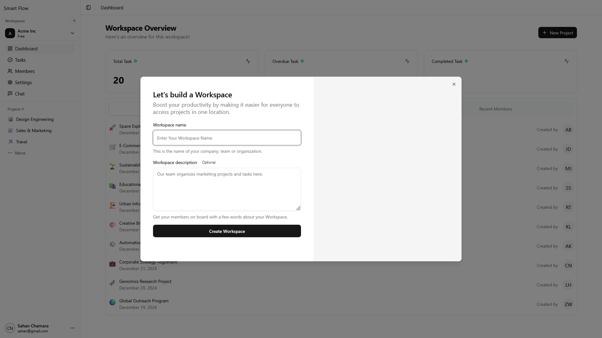
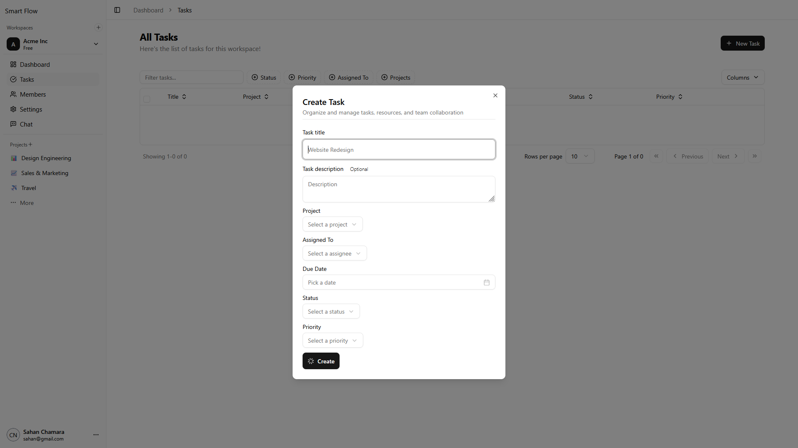

# Smart Project Manager

[](https://opensource.org/licenses/MIT)
[](https://www.mongodb.com/)
[](https://expressjs.com/)
[](https://reactjs.org/)
[](https://nodejs.org/)
[](https://www.typescriptlang.org/)
[](https://tailwindcss.com/)

## 📋 Overview

Smart Project Manager is a powerful multi-tenant project management system designed to help teams collaborate, manage tasks, and track project progress efficiently. Leveraging AI for task prioritization and real-time WebSocket communication, it provides a seamless and intelligent project management experience.


## ✨ Key Features

- **Multi-Workspace Management**: Create and manage multiple workspaces for different teams or projects
- **AI-Powered Task Prioritization**: Utilizes RandomForest algorithm to predict task priorities based on user behavior
- **Real-Time Collaboration**: Instant updates, comments, and notifications using WebSockets
- **Role-Based Access Control**: Granular permissions with Owner, Admin, and Member roles
- **Google OAuth Integration**: Seamless sign-in experience alongside traditional authentication
- **Intuitive Project Hierarchy**: Organize with projects, epics, and tasks for better structure
- **Advanced Task Filtering**: Search and filter tasks by status, priority, assignee, and more

## 🖼️ Screenshots

<div align="center">
  
  
  
  
</div>

## 🚀 Installation

```bash
# Clone the repository
git clone https://github.com/yourusername/smart-task-manager.git

# Navigate to the project directory
cd smart-task-manager

# Install backend dependencies
cd server
npm install

# Set up environment variables
cp .env.example .env
# Edit .env with your MongoDB URI, Google OAuth credentials, etc.

# Install frontend dependencies
cd ../client
npm install

# Return to root directory
cd ..
```

## 💻 Usage

```bash
# Start the backend server
cd backend
npm run dev

# In a new terminal, start the frontend
cd client
npm run dev
```

Visit `http://localhost:5173` to access the application

## 🛠️ Tech Stack

### Frontend
- **React.js** - UI library
- **TypeScript** - Type safety
- **TailwindCSS** - Styling
- **shadcn/ui** - UI component library
- **TanStack Query** - Data fetching and caching
- **Zustand** - State management
- **nuqs** - URL state management

### Backend
- **Node.js** - Runtime environment
- **Express.js** - Web framework
- **MongoDB** - NoSQL database
- **Mongoose** - ODM for MongoDB
- **WebSocket** - Real-time communication
- **Passport.js** - Authentication
- **Zod** - Schema validation
- **bcrypt** - Password hashing
- **cookie-session** - Session management

### AI/ML
- **RandomForest** - Machine learning algorithm for task priority prediction

## 🔐 Authentication

Smart Task Manager supports:
- Google OAuth authentication
- Traditional email & password authentication
- Secure session management with cookies

## 🔄 API Endpoints

| Method | Endpoint | Description |
|--------|----------|-------------|
| POST   | /api/auth/login | User login |
| POST   | /api/auth/register | User registration |
| GET    | /api/auth/google | Google OAuth login |
| GET    | /api/workspaces | Get user workspaces |
| POST   | /api/workspace/create/new | Create workspace |
| GET    | /api/projects | Get workspace projects |
| POST   | /api/tasks | Create new task |
| PUT    | /api/tasks/:id | Update task |
| GET    | /api/tasks/priority-prediction | Get AI predicted priority |

## 👥 Contributors

- Sahan Chamara - [@yourgithub]([https://github.com/yourgithub](https://github.com/SahanChamara))

## 📄 License

This project is licensed under the MIT License - see the [LICENSE](LICENSE) file for details.

## 🙏 Acknowledgements

- [React.js](https://reactjs.org/)
- [MongoDB](https://www.mongodb.com/)
- [shadcn/ui](https://ui.shadcn.com/)
- [TanStack Query](https://tanstack.com/query/latest)
- [Express.js](https://expressjs.com/)
- Youtube
- All other open-source technologies that made this project possible
